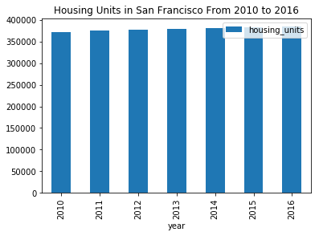
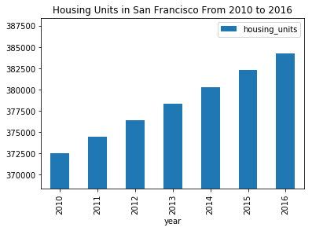
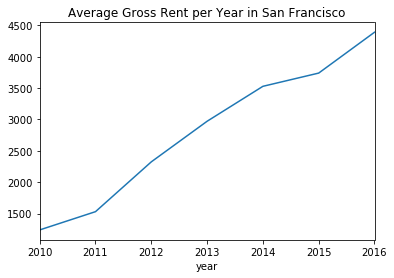
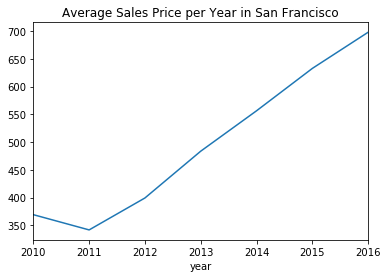

# San Francisco Housing Rental Analysis

In this assignment, you will perform basic analysis for the San Francisco Housing Market to allow potential real estate investors to choose rental investment properties. 


```python
# initial imports
import os
import pandas as pd
import matplotlib.pyplot as plt
import hvplot.pandas
import plotly.express as px
from pathlib import Path
from dotenv import load_dotenv
import panel as pn

%matplotlib inline
```


```python
# Read the Mapbox API key
load_dotenv()
mapbox_token = os.getenv("mapbox")
px.set_mapbox_access_token(mapbox_token)
```

## Load Data


```python
# Read the census data into a Pandas DataFrame
file_path = Path("Data/sfo_neighborhoods_census_data.csv")
sfo_data = pd.read_csv(file_path, index_col="year")
sfo_data.head()
```


<div>
<style scoped>
    .dataframe tbody tr th:only-of-type {
        vertical-align: middle;
    }

    .dataframe tbody tr th {
        vertical-align: top;
    }

    .dataframe thead th {
        text-align: right;
    }
</style>
<table border="1" class="dataframe">
  <thead>
    <tr style="text-align: right;">
      <th></th>
      <th>neighborhood</th>
      <th>sale_price_sqr_foot</th>
      <th>housing_units</th>
      <th>gross_rent</th>
    </tr>
    <tr>
      <th>year</th>
      <th></th>
      <th></th>
      <th></th>
      <th></th>
    </tr>
  </thead>
  <tbody>
    <tr>
      <th>2010</th>
      <td>Alamo Square</td>
      <td>291.182945</td>
      <td>372560</td>
      <td>1239</td>
    </tr>
    <tr>
      <th>2010</th>
      <td>Anza Vista</td>
      <td>267.932583</td>
      <td>372560</td>
      <td>1239</td>
    </tr>
    <tr>
      <th>2010</th>
      <td>Bayview</td>
      <td>170.098665</td>
      <td>372560</td>
      <td>1239</td>
    </tr>
    <tr>
      <th>2010</th>
      <td>Buena Vista Park</td>
      <td>347.394919</td>
      <td>372560</td>
      <td>1239</td>
    </tr>
    <tr>
      <th>2010</th>
      <td>Central Richmond</td>
      <td>319.027623</td>
      <td>372560</td>
      <td>1239</td>
    </tr>
  </tbody>
</table>
</div>


- - - 

## Housing Units Per Year

In this section, you will calculate the number of housing units per year and visualize the results as a bar chart using the Pandas plot function. 

Hint: Use the Pandas groupby function

Optional challenge: Use the min, max, and std to scale the y limits of the chart.


```python
# Calculate the mean number of housing units per year (hint: use groupby) 
sfo_data_mean = (
    sfo_data[["housing_units"]]
    .groupby("year")
    .mean()
)
sfo_data_mean
```


<div>
<style scoped>
    .dataframe tbody tr th:only-of-type {
        vertical-align: middle;
    }

    .dataframe tbody tr th {
        vertical-align: top;
    }

    .dataframe thead th {
        text-align: right;
    }
</style>
<table border="1" class="dataframe">
  <thead>
    <tr style="text-align: right;">
      <th></th>
      <th>housing_units</th>
    </tr>
    <tr>
      <th>year</th>
      <th></th>
    </tr>
  </thead>
  <tbody>
    <tr>
      <th>2010</th>
      <td>372560</td>
    </tr>
    <tr>
      <th>2011</th>
      <td>374507</td>
    </tr>
    <tr>
      <th>2012</th>
      <td>376454</td>
    </tr>
    <tr>
      <th>2013</th>
      <td>378401</td>
    </tr>
    <tr>
      <th>2014</th>
      <td>380348</td>
    </tr>
    <tr>
      <th>2015</th>
      <td>382295</td>
    </tr>
    <tr>
      <th>2016</th>
      <td>384242</td>
    </tr>
  </tbody>
</table>
</div>


```python
# Use the Pandas plot function to plot the average housing units per year.
# Note: You will need to manually adjust the y limit of the chart using the min and max values from above.


plt_chart = sfo_data_mean.plot.bar(title = "Housing Units in San Francisco From 2010 to 2016")
plt_chart
```


    <matplotlib.axes._subplots.AxesSubplot at 0x7fc08ff66890>





```python
min1 = min(sfo_data_mean['housing_units'])
max2 = max(sfo_data_mean['housing_units'])
std1 = (sfo_data_mean['housing_units']).std()
std1
```


    4206.0007132667015


```python
# Optional Challenge: Use the min, max, and std to scale the y limits of the chart

plt_chart_1= sfo_data_mean.plot.bar(title = "Housing Units in San Francisco From 2010 to 2016", ylim=(min1-std1, max2+std1))
plt_chart_1
```


    <matplotlib.axes._subplots.AxesSubplot at 0x7fc0904e4850>





- - - 

## Average Prices per Square Foot

In this section, you will calculate the average gross rent and average sales price for each year. Plot the results as a line chart.

### Average Gross Rent in San Francisco Per Year


```python
# Calculate the average gross rent and average sale price per square foot
aver_rent_price = sfo_data.iloc[:,[1,3]].groupby('year').mean()
aver_rent_price.head()
```


<div>
<style scoped>
    .dataframe tbody tr th:only-of-type {
        vertical-align: middle;
    }

    .dataframe tbody tr th {
        vertical-align: top;
    }

    .dataframe thead th {
        text-align: right;
    }
</style>
<table border="1" class="dataframe">
  <thead>
    <tr style="text-align: right;">
      <th></th>
      <th>sale_price_sqr_foot</th>
      <th>gross_rent</th>
    </tr>
    <tr>
      <th>year</th>
      <th></th>
      <th></th>
    </tr>
  </thead>
  <tbody>
    <tr>
      <th>2010</th>
      <td>369.344353</td>
      <td>1239</td>
    </tr>
    <tr>
      <th>2011</th>
      <td>341.903429</td>
      <td>1530</td>
    </tr>
    <tr>
      <th>2012</th>
      <td>399.389968</td>
      <td>2324</td>
    </tr>
    <tr>
      <th>2013</th>
      <td>483.600304</td>
      <td>2971</td>
    </tr>
    <tr>
      <th>2014</th>
      <td>556.277273</td>
      <td>3528</td>
    </tr>
  </tbody>
</table>
</div>


```python
# Plot the Average Gross Rent per Year as a Line Chart 
aver_gross_rent = aver_rent_price["gross_rent"]

aver_gross_rent_gr = aver_gross_rent.plot(title = "Average Gross Rent per Year in San Francisco")
aver_gross_rent_gr
```


    <matplotlib.axes._subplots.AxesSubplot at 0x7fc0910645d0>





### Average Sales Price per Year


```python
# Plot the Average Sales Price per Year as a line chart
aver_sales_price = aver_rent_price["sale_price_sqr_foot"]

aver_sales_price_gr= aver_sales_price.plot(title = "Average Sales Price per Year in San Francisco")
aver_sales_price_gr
```


    <matplotlib.axes._subplots.AxesSubplot at 0x7fc091e0ddd0>





- - - 

## Average Prices by Neighborhood

In this section, you will use hvplot to create an interactive visulization of the Average Prices with a dropdown selector for the neighborhood.

Hint: It will be easier to create a new DataFrame from grouping the data and calculating the mean prices for each year and neighborhood


```python
# Group by year and neighborhood and then create a new dataframe of the mean values
group_by_neigh = sfo_data.groupby(['neighborhood', "year"]).mean()
group_by_neigh.head()
```


<div>
<style scoped>
    .dataframe tbody tr th:only-of-type {
        vertical-align: middle;
    }

    .dataframe tbody tr th {
        vertical-align: top;
    }

    .dataframe thead th {
        text-align: right;
    }
</style>
<table border="1" class="dataframe">
  <thead>
    <tr style="text-align: right;">
      <th></th>
      <th></th>
      <th>sale_price_sqr_foot</th>
      <th>housing_units</th>
      <th>gross_rent</th>
    </tr>
    <tr>
      <th>neighborhood</th>
      <th>year</th>
      <th></th>
      <th></th>
      <th></th>
    </tr>
  </thead>
  <tbody>
    <tr>
      <th rowspan="5" valign="top">Alamo Square</th>
      <th>2010</th>
      <td>291.182945</td>
      <td>372560</td>
      <td>1239</td>
    </tr>
    <tr>
      <th>2011</th>
      <td>272.527310</td>
      <td>374507</td>
      <td>1530</td>
    </tr>
    <tr>
      <th>2012</th>
      <td>183.099317</td>
      <td>376454</td>
      <td>2324</td>
    </tr>
    <tr>
      <th>2013</th>
      <td>387.794144</td>
      <td>378401</td>
      <td>2971</td>
    </tr>
    <tr>
      <th>2014</th>
      <td>484.443552</td>
      <td>380348</td>
      <td>3528</td>
    </tr>
  </tbody>
</table>
</div>


```python
# Use hvplot to create an interactive line chart of the average price per sq ft.
# The plot should have a dropdown selector for the neighborhood
plot_data = group_by_neigh.drop(columns=['housing_units', 'gross_rent'])
plot_data.head()
```


<div>
<style scoped>
    .dataframe tbody tr th:only-of-type {
        vertical-align: middle;
    }

    .dataframe tbody tr th {
        vertical-align: top;
    }

    .dataframe thead th {
        text-align: right;
    }
</style>
<table border="1" class="dataframe">
  <thead>
    <tr style="text-align: right;">
      <th></th>
      <th></th>
      <th>sale_price_sqr_foot</th>
    </tr>
    <tr>
      <th>neighborhood</th>
      <th>year</th>
      <th></th>
    </tr>
  </thead>
  <tbody>
    <tr>
      <th rowspan="5" valign="top">Alamo Square</th>
      <th>2010</th>
      <td>291.182945</td>
    </tr>
    <tr>
      <th>2011</th>
      <td>272.527310</td>
    </tr>
    <tr>
      <th>2012</th>
      <td>183.099317</td>
    </tr>
    <tr>
      <th>2013</th>
      <td>387.794144</td>
    </tr>
    <tr>
      <th>2014</th>
      <td>484.443552</td>
    </tr>
  </tbody>
</table>
</div>


```python
plot_data1 = plot_data.reset_index()
```


```python
plot_data1.head()
```


<div>
<style scoped>
    .dataframe tbody tr th:only-of-type {
        vertical-align: middle;
    }

    .dataframe tbody tr th {
        vertical-align: top;
    }

    .dataframe thead th {
        text-align: right;
    }
</style>
<table border="1" class="dataframe">
  <thead>
    <tr style="text-align: right;">
      <th></th>
      <th>neighborhood</th>
      <th>year</th>
      <th>sale_price_sqr_foot</th>
    </tr>
  </thead>
  <tbody>
    <tr>
      <th>0</th>
      <td>Alamo Square</td>
      <td>2010</td>
      <td>291.182945</td>
    </tr>
    <tr>
      <th>1</th>
      <td>Alamo Square</td>
      <td>2011</td>
      <td>272.527310</td>
    </tr>
    <tr>
      <th>2</th>
      <td>Alamo Square</td>
      <td>2012</td>
      <td>183.099317</td>
    </tr>
    <tr>
      <th>3</th>
      <td>Alamo Square</td>
      <td>2013</td>
      <td>387.794144</td>
    </tr>
    <tr>
      <th>4</th>
      <td>Alamo Square</td>
      <td>2014</td>
      <td>484.443552</td>
    </tr>
  </tbody>
</table>
</div>


```python
#adding np extention 
pn.extension()
```


```python
plot_data_gr = plot_data1.hvplot(label= "the average price per sq ft by neighborhood", groupby = "neighborhood", x = "year", y="sale_price_sqr_foot")
plot_data_gr
```


<div id='3788'>


  <div class="bk-root" id="539a18ef-18ab-4a0b-958b-461e61e39adf" data-root-id="3788"></div>
</div>
<script type="application/javascript">(function(root) {
  function embed_document(root) {
  var docs_json = {"4f5e3921-9a42-4488-ad97-120a6dc2fa04":{"roots":{"references":[{"attributes":{"axis_label":"year","bounds":"auto","formatter":{"id":"3832"},"major_label_orientation":"horizontal","ticker":{"id":"3803"}},"id":"3802","type":"LinearAxis"},{"attributes":{"active_drag":"auto","active_inspect":"auto","active_multi":null,"active_scroll":"auto","active_tap":"auto","tools":[{"id":"3792"},{"id":"3810"},{"id":"3811"},{"id":"3812"},{"id":"3813"},{"id":"3814"}]},"id":"3816","type":"Toolbar"},{"attributes":{},"id":"3810","type":"SaveTool"},{"attributes":{},"id":"3800","type":"LinearScale"},{"attributes":{"end":2016.0,"reset_end":2016.0,"reset_start":2010.0,"start":2010.0,"tags":[[["year","year",null]]]},"id":"3790","type":"Range1d"},{"attributes":{"source":{"id":"3823"}},"id":"3830","type":"CDSView"},{"attributes":{"data_source":{"id":"3823"},"glyph":{"id":"3826"},"hover_glyph":null,"muted_glyph":{"id":"3828"},"nonselection_glyph":{"id":"3827"},"selection_glyph":null,"view":{"id":"3830"}},"id":"3829","type":"GlyphRenderer"},{"attributes":{"axis":{"id":"3802"},"grid_line_color":null,"ticker":null},"id":"3805","type":"Grid"},{"attributes":{"callback":null,"renderers":[{"id":"3829"}],"tags":["hv_created"],"tooltips":[["year","@{year}"],["sale_price_sqr_foot","@{sale_price_sqr_foot}"]]},"id":"3792","type":"HoverTool"},{"attributes":{"overlay":{"id":"3815"}},"id":"3813","type":"BoxZoomTool"},{"attributes":{},"id":"3832","type":"BasicTickFormatter"},{"attributes":{},"id":"3845","type":"UnionRenderers"},{"attributes":{"margin":[5,5,5,5],"name":"VSpacer06919","sizing_mode":"stretch_height"},"id":"3857","type":"Spacer"},{"attributes":{},"id":"3814","type":"ResetTool"},{"attributes":{"axis":{"id":"3806"},"dimension":1,"grid_line_color":null,"ticker":null},"id":"3809","type":"Grid"},{"attributes":{"margin":[20,20,20,20],"min_width":250,"options":["Alamo Square","Anza Vista","Bayview","Bayview Heights","Bernal Heights ","Buena Vista Park","Central Richmond","Central Sunset","Clarendon Heights","Corona Heights","Cow Hollow","Croker Amazon","Diamond Heights","Downtown ","Duboce Triangle","Eureka Valley/Dolores Heights","Excelsior","Financial District North","Financial District South","Forest Knolls","Glen Park","Golden Gate Heights","Haight Ashbury","Hayes Valley","Hunters Point","Ingleside ","Ingleside Heights","Inner Mission","Inner Parkside","Inner Richmond","Inner Sunset","Jordan Park/Laurel Heights","Lake --The Presidio","Lone Mountain","Lower Pacific Heights","Marina","Merced Heights","Midtown Terrace","Miraloma Park","Mission Bay","Mission Dolores","Mission Terrace","Nob Hill","Noe Valley","North Beach","North Waterfront","Oceanview","Outer Mission","Outer Parkside","Outer Richmond ","Outer Sunset","Pacific Heights","Park North","Parkside","Parnassus/Ashbury Heights","Portola","Potrero Hill","Presidio Heights","Russian Hill","Silver Terrace","South Beach","South of Market","Sunnyside","Telegraph Hill","Twin Peaks","Union Square District","Van Ness/ Civic Center","Visitacion Valley","West Portal","Western Addition","Westwood Highlands","Westwood Park","Yerba Buena"],"title":"neighborhood","value":"Alamo Square","width":250},"id":"3859","type":"Select"},{"attributes":{"align":null,"below":[{"id":"3802"}],"center":[{"id":"3805"},{"id":"3809"}],"left":[{"id":"3806"}],"margin":null,"min_border_bottom":10,"min_border_left":10,"min_border_right":10,"min_border_top":10,"plot_height":300,"plot_width":700,"renderers":[{"id":"3829"}],"sizing_mode":"fixed","title":{"id":"3794"},"toolbar":{"id":"3816"},"x_range":{"id":"3790"},"x_scale":{"id":"3798"},"y_range":{"id":"3791"},"y_scale":{"id":"3800"}},"id":"3793","subtype":"Figure","type":"Plot"},{"attributes":{},"id":"3834","type":"BasicTickFormatter"},{"attributes":{},"id":"3811","type":"PanTool"},{"attributes":{"bottom_units":"screen","fill_alpha":0.5,"fill_color":"lightgrey","left_units":"screen","level":"overlay","line_alpha":1.0,"line_color":"black","line_dash":[4,4],"line_width":2,"right_units":"screen","top_units":"screen"},"id":"3815","type":"BoxAnnotation"},{"attributes":{"children":[{"id":"3859"}],"css_classes":["panel-widget-box"],"margin":[5,5,5,5],"name":"WidgetBox06914"},"id":"3858","type":"Column"},{"attributes":{"data":{"sale_price_sqr_foot":{"__ndarray__":"Dkc7WO0yckCafszcbwhxQIGRs5ot42ZAJzog0LQ8eEAWMinKGEd+QI0V5FDt0IJAVCHcmLVPdUA=","dtype":"float64","order":"little","shape":[7]},"year":[2010,2011,2012,2013,2014,2015,2016]},"selected":{"id":"3824"},"selection_policy":{"id":"3845"}},"id":"3823","type":"ColumnDataSource"},{"attributes":{"children":[{"id":"3789"},{"id":"3793"},{"id":"3855"},{"id":"3856"}],"margin":[0,0,0,0],"name":"Row06913"},"id":"3788","type":"Row"},{"attributes":{"line_alpha":0.1,"line_color":"#1f77b3","line_width":2,"x":{"field":"year"},"y":{"field":"sale_price_sqr_foot"}},"id":"3827","type":"Line"},{"attributes":{"margin":[5,5,5,5],"name":"HSpacer06923","sizing_mode":"stretch_width"},"id":"3855","type":"Spacer"},{"attributes":{"children":[{"id":"3857"},{"id":"3858"},{"id":"3860"}],"margin":[0,0,0,0],"name":"Column06921"},"id":"3856","type":"Column"},{"attributes":{"line_alpha":0.2,"line_color":"#1f77b3","line_width":2,"x":{"field":"year"},"y":{"field":"sale_price_sqr_foot"}},"id":"3828","type":"Line"},{"attributes":{"line_color":"#1f77b3","line_width":2,"x":{"field":"year"},"y":{"field":"sale_price_sqr_foot"}},"id":"3826","type":"Line"},{"attributes":{"end":644.0175329447045,"reset_end":644.0175329447045,"reset_start":141.1976609302527,"start":141.1976609302527,"tags":[[["sale_price_sqr_foot","sale_price_sqr_foot",null]]]},"id":"3791","type":"Range1d"},{"attributes":{"margin":[5,5,5,5],"name":"HSpacer06922","sizing_mode":"stretch_width"},"id":"3789","type":"Spacer"},{"attributes":{},"id":"3824","type":"Selection"},{"attributes":{},"id":"3798","type":"LinearScale"},{"attributes":{},"id":"3803","type":"BasicTicker"},{"attributes":{"client_comm_id":"891a8d5ef71d4e259fc310986d66815d","comm_id":"2ad76867e65f4e3d8af6cdc77a422f76","plot_id":"3788"},"id":"3885","type":"panel.models.comm_manager.CommManager"},{"attributes":{},"id":"3812","type":"WheelZoomTool"},{"attributes":{"axis_label":"sale_price_sqr_foot","bounds":"auto","formatter":{"id":"3834"},"major_label_orientation":"horizontal","ticker":{"id":"3807"}},"id":"3806","type":"LinearAxis"},{"attributes":{},"id":"3807","type":"BasicTicker"},{"attributes":{"margin":[5,5,5,5],"name":"VSpacer06920","sizing_mode":"stretch_height"},"id":"3860","type":"Spacer"},{"attributes":{"text":"the average price per sq ft by neighborhood  neighborhood: Alamo Square","text_color":{"value":"black"},"text_font_size":{"value":"12pt"}},"id":"3794","type":"Title"}],"root_ids":["3788","3885"]},"title":"Bokeh Application","version":"2.1.1"}};
  var render_items = [{"docid":"4f5e3921-9a42-4488-ad97-120a6dc2fa04","root_ids":["3788"],"roots":{"3788":"539a18ef-18ab-4a0b-958b-461e61e39adf"}}];
  root.Bokeh.embed.embed_items_notebook(docs_json, render_items);
  }
if (root.Bokeh !== undefined) {
    embed_document(root);
  } else {
    var attempts = 0;
    var timer = setInterval(function(root) {
      if (root.Bokeh !== undefined) {
        clearInterval(timer);
        embed_document(root);
      } else if (document.readyState == "complete") {
        attempts++;
        if (attempts > 100) {
          clearInterval(timer);
          console.log("Bokeh: ERROR: Unable to run BokehJS code because BokehJS library is missing");
        }
      }
    }, 10, root)
  }
})(window);</script>


- - - 

## The Top 10 Most Expensive Neighborhoods

In this section, you will need to calculate the mean sale price for each neighborhood and then sort the values to obtain the top 10 most expensive neighborhoods on average. Plot the results as a bar chart.


```python
# Getting the data from the top 10 expensive neighborhoods
sfo_data_2 = sfo_data.groupby('neighborhood').mean().sort_values('sale_price_sqr_foot', ascending=False).rename(columns={"sale_price_sqr_foot": "average_sale_price_sqr_foot"})
sfo_data_2.head(10)
```


<div>
<style scoped>
    .dataframe tbody tr th:only-of-type {
        vertical-align: middle;
    }

    .dataframe tbody tr th {
        vertical-align: top;
    }

    .dataframe thead th {
        text-align: right;
    }
</style>
<table border="1" class="dataframe">
  <thead>
    <tr style="text-align: right;">
      <th></th>
      <th>average_sale_price_sqr_foot</th>
      <th>housing_units</th>
      <th>gross_rent</th>
    </tr>
    <tr>
      <th>neighborhood</th>
      <th></th>
      <th></th>
      <th></th>
    </tr>
  </thead>
  <tbody>
    <tr>
      <th>Union Square District</th>
      <td>903.993258</td>
      <td>377427.50</td>
      <td>2555.166667</td>
    </tr>
    <tr>
      <th>Merced Heights</th>
      <td>788.844818</td>
      <td>380348.00</td>
      <td>3414.000000</td>
    </tr>
    <tr>
      <th>Miraloma Park</th>
      <td>779.810842</td>
      <td>375967.25</td>
      <td>2155.250000</td>
    </tr>
    <tr>
      <th>Pacific Heights</th>
      <td>689.555817</td>
      <td>378401.00</td>
      <td>2817.285714</td>
    </tr>
    <tr>
      <th>Westwood Park</th>
      <td>687.087575</td>
      <td>382295.00</td>
      <td>3959.000000</td>
    </tr>
    <tr>
      <th>Telegraph Hill</th>
      <td>676.506578</td>
      <td>378401.00</td>
      <td>2817.285714</td>
    </tr>
    <tr>
      <th>Presidio Heights</th>
      <td>675.350212</td>
      <td>378401.00</td>
      <td>2817.285714</td>
    </tr>
    <tr>
      <th>Cow Hollow</th>
      <td>665.964042</td>
      <td>378401.00</td>
      <td>2817.285714</td>
    </tr>
    <tr>
      <th>Potrero Hill</th>
      <td>662.013613</td>
      <td>378401.00</td>
      <td>2817.285714</td>
    </tr>
    <tr>
      <th>South Beach</th>
      <td>650.124479</td>
      <td>375805.00</td>
      <td>2099.000000</td>
    </tr>
  </tbody>
</table>
</div>


```python
# Plotting the data from the top 10 expensive neighborhoods
sfo_data_2_gr = sfo_data_2.iloc[0:10, 0].hvplot.bar(label = "The top 10 expensive neighborhoods in San Francisco From 2010 to 2016", rot=90)
sfo_data_2_gr
```


<div id='4155'>


  <div class="bk-root" id="95aa8caa-55c5-4b0d-91d9-25bded4dd1bc" data-root-id="4155"></div>
</div>
<script type="application/javascript">(function(root) {
  function embed_document(root) {
  var docs_json = {"db6d35d3-e56b-4cbf-9335-e5a7d29357c4":{"roots":{"references":[{"attributes":{},"id":"4173","type":"BasicTicker"},{"attributes":{"children":[{"id":"4156"},{"id":"4160"},{"id":"4217"}],"margin":[0,0,0,0],"name":"Row08015","tags":["embedded"]},"id":"4155","type":"Row"},{"attributes":{},"id":"4167","type":"LinearScale"},{"attributes":{},"id":"4197","type":"CategoricalTickFormatter"},{"attributes":{"data":{"average_sale_price_sqr_foot":{"__ndarray__":"JRAUMfI/jEB9IrkvwqaIQFx/3pp8XohAFpsVUHKMhUBs0ERas3iFQL0KhXgNJIVAy835O80ahUANV25bts+EQJrMCuEbsIRAya3y7v5QhEA=","dtype":"float64","order":"little","shape":[10]},"neighborhood":["Union Square District","Merced Heights","Miraloma Park","Pacific Heights","Westwood Park","Telegraph Hill","Presidio Heights","Cow Hollow","Potrero Hill","South Beach"]},"selected":{"id":"4190"},"selection_policy":{"id":"4207"}},"id":"4189","type":"ColumnDataSource"},{"attributes":{"axis":{"id":"4169"},"grid_line_color":null,"ticker":null},"id":"4171","type":"Grid"},{"attributes":{"margin":[5,5,5,5],"name":"HSpacer08019","sizing_mode":"stretch_width"},"id":"4156","type":"Spacer"},{"attributes":{},"id":"4176","type":"SaveTool"},{"attributes":{"axis_label":"","bounds":"auto","formatter":{"id":"4200"},"major_label_orientation":"horizontal","ticker":{"id":"4173"}},"id":"4172","type":"LinearAxis"},{"attributes":{"overlay":{"id":"4181"}},"id":"4179","type":"BoxZoomTool"},{"attributes":{},"id":"4190","type":"Selection"},{"attributes":{"axis":{"id":"4172"},"dimension":1,"grid_line_color":null,"ticker":null},"id":"4175","type":"Grid"},{"attributes":{},"id":"4180","type":"ResetTool"},{"attributes":{"fill_alpha":{"value":0.2},"fill_color":{"value":"#1f77b3"},"line_alpha":{"value":0.2},"top":{"field":"average_sale_price_sqr_foot"},"width":{"value":0.8},"x":{"field":"neighborhood"}},"id":"4194","type":"VBar"},{"attributes":{"fill_color":{"value":"#1f77b3"},"top":{"field":"average_sale_price_sqr_foot"},"width":{"value":0.8},"x":{"field":"neighborhood"}},"id":"4192","type":"VBar"},{"attributes":{"align":null,"below":[{"id":"4169"}],"center":[{"id":"4171"},{"id":"4175"}],"left":[{"id":"4172"}],"margin":null,"min_border_bottom":10,"min_border_left":10,"min_border_right":10,"min_border_top":10,"plot_height":300,"plot_width":700,"renderers":[{"id":"4195"}],"sizing_mode":"fixed","title":{"id":"4161"},"toolbar":{"id":"4182"},"x_range":{"id":"4157"},"x_scale":{"id":"4165"},"y_range":{"id":"4158"},"y_scale":{"id":"4167"}},"id":"4160","subtype":"Figure","type":"Plot"},{"attributes":{},"id":"4170","type":"CategoricalTicker"},{"attributes":{"data_source":{"id":"4189"},"glyph":{"id":"4192"},"hover_glyph":null,"muted_glyph":{"id":"4194"},"nonselection_glyph":{"id":"4193"},"selection_glyph":null,"view":{"id":"4196"}},"id":"4195","type":"GlyphRenderer"},{"attributes":{"source":{"id":"4189"}},"id":"4196","type":"CDSView"},{"attributes":{"axis_label":"neighborhood","bounds":"auto","formatter":{"id":"4197"},"major_label_orientation":1.5707963267948966,"ticker":{"id":"4170"}},"id":"4169","type":"CategoricalAxis"},{"attributes":{},"id":"4177","type":"PanTool"},{"attributes":{"end":929.3801355198136,"reset_end":929.3801355198136,"reset_start":0.0,"tags":[[["average_sale_price_sqr_foot","average_sale_price_sqr_foot",null]]]},"id":"4158","type":"Range1d"},{"attributes":{"bottom_units":"screen","fill_alpha":0.5,"fill_color":"lightgrey","left_units":"screen","level":"overlay","line_alpha":1.0,"line_color":"black","line_dash":[4,4],"line_width":2,"right_units":"screen","top_units":"screen"},"id":"4181","type":"BoxAnnotation"},{"attributes":{"callback":null,"renderers":[{"id":"4195"}],"tags":["hv_created"],"tooltips":[["neighborhood","@{neighborhood}"],["average_sale_price_sqr_foot","@{average_sale_price_sqr_foot}"]]},"id":"4159","type":"HoverTool"},{"attributes":{"text":"The top 10 expensive neighborhoods in San Francisco From 2010 to 2016","text_color":{"value":"black"},"text_font_size":{"value":"12pt"}},"id":"4161","type":"Title"},{"attributes":{"active_drag":"auto","active_inspect":"auto","active_multi":null,"active_scroll":"auto","active_tap":"auto","tools":[{"id":"4159"},{"id":"4176"},{"id":"4177"},{"id":"4178"},{"id":"4179"},{"id":"4180"}]},"id":"4182","type":"Toolbar"},{"attributes":{},"id":"4165","type":"CategoricalScale"},{"attributes":{},"id":"4200","type":"BasicTickFormatter"},{"attributes":{"margin":[5,5,5,5],"name":"HSpacer08020","sizing_mode":"stretch_width"},"id":"4217","type":"Spacer"},{"attributes":{},"id":"4207","type":"UnionRenderers"},{"attributes":{},"id":"4178","type":"WheelZoomTool"},{"attributes":{"fill_alpha":{"value":0.1},"fill_color":{"value":"#1f77b3"},"line_alpha":{"value":0.1},"top":{"field":"average_sale_price_sqr_foot"},"width":{"value":0.8},"x":{"field":"neighborhood"}},"id":"4193","type":"VBar"},{"attributes":{"factors":["Union Square District","Merced Heights","Miraloma Park","Pacific Heights","Westwood Park","Telegraph Hill","Presidio Heights","Cow Hollow","Potrero Hill","South Beach"],"tags":[[["neighborhood","neighborhood",null]]]},"id":"4157","type":"FactorRange"}],"root_ids":["4155"]},"title":"Bokeh Application","version":"2.1.1"}};
  var render_items = [{"docid":"db6d35d3-e56b-4cbf-9335-e5a7d29357c4","root_ids":["4155"],"roots":{"4155":"95aa8caa-55c5-4b0d-91d9-25bded4dd1bc"}}];
  root.Bokeh.embed.embed_items_notebook(docs_json, render_items);
  }
if (root.Bokeh !== undefined) {
    embed_document(root);
  } else {
    var attempts = 0;
    var timer = setInterval(function(root) {
      if (root.Bokeh !== undefined) {
        clearInterval(timer);
        embed_document(root);
      } else if (document.readyState == "complete") {
        attempts++;
        if (attempts > 100) {
          clearInterval(timer);
          console.log("Bokeh: ERROR: Unable to run BokehJS code because BokehJS library is missing");
        }
      }
    }, 10, root)
  }
})(window);</script>


- - - 

## Parallel Coordinates and Parallel Categories Analysis

In this section, you will use plotly express to create parallel coordinates and parallel categories visualizations so that investors can interactively filter and explore various factors related to the sales price of the neighborhoods. 

Using the DataFrame of Average values per neighborhood (calculated above), create the following visualizations:
1. Create a Parallel Coordinates Plot
2. Create a Parallel Categories Plot


```python
sfo_data_2 = sfo_data_2.reset_index()
```


```python
# Parallel Coordinates Plot 
parallel_coordinates = px.parallel_coordinates(sfo_data_2, color="average_sale_price_sqr_foot", 
                       title="A Parallel Coordinates Analysis of the Top Ten Most Expensive Neighborhoods")
parallel_coordinates
```


<div>


            <div id="4b3680f6-5de8-4edf-b9a4-a40365afe9e0" class="plotly-graph-div" style="height:525px; width:100%;"></div>
            <script type="text/javascript">
                require(["plotly"], function(Plotly) {
                    window.PLOTLYENV=window.PLOTLYENV || {};

                if (document.getElementById("4b3680f6-5de8-4edf-b9a4-a40365afe9e0")) {
                    Plotly.newPlot(
                        '4b3680f6-5de8-4edf-b9a4-a40365afe9e0',
                        [{"dimensions": [{"label": "average_sale_price_sqr_foot", "values": [903.9932576720645, 788.8448175872469, 779.810842264425, 689.5558168113664, 687.0875745178323, 676.5065775293257, 675.3502120510033, 665.964041578323, 662.0136128276529, 650.1244791945729, 642.2486706357391, 639.3935574881156, 632.740453508577, 623.826177537435, 608.9832172374425, 590.7928388746802, 587.5390673661739, 583.7492694814549, 576.7464881132382, 576.709848378276, 570.2714266991686, 566.1922135483312, 550.5103482917151, 542.4429128151736, 539.2379688783261, 533.7039354359513, 529.3841850673389, 528.3183317138463, 523.4662013248023, 519.3856038526768, 502.59915555623616, 498.4884848295011, 498.26975500787677, 487.2448860262575, 485.0270126111035, 478.2285530213679, 473.90077331796317, 469.39862649935156, 458.2040944846015, 455.83621223779153, 452.6805909308442, 449.5447622856192, 434.99173944522124, 423.6879277015824, 418.9156225067234, 413.66751546215943, 411.646875881678, 409.95435219297514, 404.1501801622257, 397.67371473613446, 394.4223987800589, 394.21903228550775, 391.43437776742576, 391.36253308010487, 388.76592700230754, 384.7979281346048, 378.59431396136455, 373.732856371763, 373.38219782647707, 367.8951440852775, 366.02071153227644, 355.9328279480578, 336.172661037069, 330.0973846552545, 327.11392534647274, 321.84083657398736, 307.56220097996066, 303.00418440849427, 301.46617997450267, 242.37095202049667, 204.58862288246596, 170.62491987132685, 170.2925485152069]}, {"label": "housing_units", "values": [377427.5, 380348.0, 375967.25, 378401.0, 382295.0, 378401.0, 378401.0, 378401.0, 378401.0, 375805.0, 378401.0, 377622.2, 378401.0, 378725.5, 378401.0, 382295.0, 377232.8, 378401.0, 379374.5, 377427.5, 378401.0, 377752.0, 377427.5, 378401.0, 378401.0, 376454.0, 378401.0, 378725.5, 379569.2, 379861.25, 378401.0, 376940.75, 378401.0, 376454.0, 378401.0, 377427.5, 378401.0, 378401.0, 378401.0, 377232.8, 378076.5, 378401.0, 375480.5, 378401.0, 377427.5, 378401.0, 379179.8, 377427.5, 378401.0, 378401.0, 378401.0, 378401.0, 378401.0, 378401.0, 379050.0, 379374.5, 378401.0, 378401.0, 379050.0, 377427.5, 378401.0, 378401.0, 377427.5, 377103.0, 376454.0, 374507.0, 377427.5, 378076.5, 381321.5, 379374.5, 376454.0, 377427.5, 380348.0]}, {"label": "gross_rent", "values": [2555.1666666666665, 3414.0, 2155.25, 2817.285714285714, 3959.0, 2817.285714285714, 2817.285714285714, 2817.285714285714, 2817.285714285714, 2099.0, 2817.285714285714, 2601.4, 2817.285714285714, 2899.5, 2817.285714285714, 3739.0, 2472.0, 2817.285714285714, 3080.3333333333335, 2555.1666666666665, 2817.285714285714, 2663.6666666666665, 2647.5, 2817.285714285714, 2817.285714285714, 2250.5, 2817.285714285714, 2899.5, 3173.4, 3224.0, 2780.25, 2515.5, 2818.4, 2250.5, 2817.285714285714, 2555.1666666666665, 2817.285714285714, 2817.285714285714, 2817.285714285714, 2472.0, 2698.8333333333335, 2817.285714285714, 2016.0, 2817.285714285714, 2555.1666666666665, 2817.285714285714, 2990.8, 2555.1666666666665, 2817.285714285714, 2817.285714285714, 2817.285714285714, 2817.285714285714, 2817.285714285714, 2817.285714285714, 3031.8333333333335, 2960.0, 2817.285714285714, 2817.285714285714, 3031.8333333333335, 2509.0, 2817.285714285714, 2817.285714285714, 2555.1666666666665, 2434.0, 2318.4, 1781.5, 2555.1666666666665, 2698.8333333333335, 3657.0, 2995.75, 2318.4, 2489.0, 3528.0]}], "domain": {"x": [0.0, 1.0], "y": [0.0, 1.0]}, "line": {"color": [903.9932576720645, 788.8448175872469, 779.810842264425, 689.5558168113664, 687.0875745178323, 676.5065775293257, 675.3502120510033, 665.964041578323, 662.0136128276529, 650.1244791945729, 642.2486706357391, 639.3935574881156, 632.740453508577, 623.826177537435, 608.9832172374425, 590.7928388746802, 587.5390673661739, 583.7492694814549, 576.7464881132382, 576.709848378276, 570.2714266991686, 566.1922135483312, 550.5103482917151, 542.4429128151736, 539.2379688783261, 533.7039354359513, 529.3841850673389, 528.3183317138463, 523.4662013248023, 519.3856038526768, 502.59915555623616, 498.4884848295011, 498.26975500787677, 487.2448860262575, 485.0270126111035, 478.2285530213679, 473.90077331796317, 469.39862649935156, 458.2040944846015, 455.83621223779153, 452.6805909308442, 449.5447622856192, 434.99173944522124, 423.6879277015824, 418.9156225067234, 413.66751546215943, 411.646875881678, 409.95435219297514, 404.1501801622257, 397.67371473613446, 394.4223987800589, 394.21903228550775, 391.43437776742576, 391.36253308010487, 388.76592700230754, 384.7979281346048, 378.59431396136455, 373.732856371763, 373.38219782647707, 367.8951440852775, 366.02071153227644, 355.9328279480578, 336.172661037069, 330.0973846552545, 327.11392534647274, 321.84083657398736, 307.56220097996066, 303.00418440849427, 301.46617997450267, 242.37095202049667, 204.58862288246596, 170.62491987132685, 170.2925485152069], "coloraxis": "coloraxis"}, "name": "", "type": "parcoords"}],
                        {"coloraxis": {"colorbar": {"title": {"text": "average_sale_price_sqr_foot"}}, "colorscale": [[0.0, "#0d0887"], [0.1111111111111111, "#46039f"], [0.2222222222222222, "#7201a8"], [0.3333333333333333, "#9c179e"], [0.4444444444444444, "#bd3786"], [0.5555555555555556, "#d8576b"], [0.6666666666666666, "#ed7953"], [0.7777777777777778, "#fb9f3a"], [0.8888888888888888, "#fdca26"], [1.0, "#f0f921"]]}, "legend": {"tracegroupgap": 0}, "template": {"data": {"bar": [{"error_x": {"color": "#2a3f5f"}, "error_y": {"color": "#2a3f5f"}, "marker": {"line": {"color": "#E5ECF6", "width": 0.5}}, "type": "bar"}], "barpolar": [{"marker": {"line": {"color": "#E5ECF6", "width": 0.5}}, "type": "barpolar"}], "carpet": [{"aaxis": {"endlinecolor": "#2a3f5f", "gridcolor": "white", "linecolor": "white", "minorgridcolor": "white", "startlinecolor": "#2a3f5f"}, "baxis": {"endlinecolor": "#2a3f5f", "gridcolor": "white", "linecolor": "white", "minorgridcolor": "white", "startlinecolor": "#2a3f5f"}, "type": "carpet"}], "choropleth": [{"colorbar": {"outlinewidth": 0, "ticks": ""}, "type": "choropleth"}], "contour": [{"colorbar": {"outlinewidth": 0, "ticks": ""}, "colorscale": [[0.0, "#0d0887"], [0.1111111111111111, "#46039f"], [0.2222222222222222, "#7201a8"], [0.3333333333333333, "#9c179e"], [0.4444444444444444, "#bd3786"], [0.5555555555555556, "#d8576b"], [0.6666666666666666, "#ed7953"], [0.7777777777777778, "#fb9f3a"], [0.8888888888888888, "#fdca26"], [1.0, "#f0f921"]], "type": "contour"}], "contourcarpet": [{"colorbar": {"outlinewidth": 0, "ticks": ""}, "type": "contourcarpet"}], "heatmap": [{"colorbar": {"outlinewidth": 0, "ticks": ""}, "colorscale": [[0.0, "#0d0887"], [0.1111111111111111, "#46039f"], [0.2222222222222222, "#7201a8"], [0.3333333333333333, "#9c179e"], [0.4444444444444444, "#bd3786"], [0.5555555555555556, "#d8576b"], [0.6666666666666666, "#ed7953"], [0.7777777777777778, "#fb9f3a"], [0.8888888888888888, "#fdca26"], [1.0, "#f0f921"]], "type": "heatmap"}], "heatmapgl": [{"colorbar": {"outlinewidth": 0, "ticks": ""}, "colorscale": [[0.0, "#0d0887"], [0.1111111111111111, "#46039f"], [0.2222222222222222, "#7201a8"], [0.3333333333333333, "#9c179e"], [0.4444444444444444, "#bd3786"], [0.5555555555555556, "#d8576b"], [0.6666666666666666, "#ed7953"], [0.7777777777777778, "#fb9f3a"], [0.8888888888888888, "#fdca26"], [1.0, "#f0f921"]], "type": "heatmapgl"}], "histogram": [{"marker": {"colorbar": {"outlinewidth": 0, "ticks": ""}}, "type": "histogram"}], "histogram2d": [{"colorbar": {"outlinewidth": 0, "ticks": ""}, "colorscale": [[0.0, "#0d0887"], [0.1111111111111111, "#46039f"], [0.2222222222222222, "#7201a8"], [0.3333333333333333, "#9c179e"], [0.4444444444444444, "#bd3786"], [0.5555555555555556, "#d8576b"], [0.6666666666666666, "#ed7953"], [0.7777777777777778, "#fb9f3a"], [0.8888888888888888, "#fdca26"], [1.0, "#f0f921"]], "type": "histogram2d"}], "histogram2dcontour": [{"colorbar": {"outlinewidth": 0, "ticks": ""}, "colorscale": [[0.0, "#0d0887"], [0.1111111111111111, "#46039f"], [0.2222222222222222, "#7201a8"], [0.3333333333333333, "#9c179e"], [0.4444444444444444, "#bd3786"], [0.5555555555555556, "#d8576b"], [0.6666666666666666, "#ed7953"], [0.7777777777777778, "#fb9f3a"], [0.8888888888888888, "#fdca26"], [1.0, "#f0f921"]], "type": "histogram2dcontour"}], "mesh3d": [{"colorbar": {"outlinewidth": 0, "ticks": ""}, "type": "mesh3d"}], "parcoords": [{"line": {"colorbar": {"outlinewidth": 0, "ticks": ""}}, "type": "parcoords"}], "pie": [{"automargin": true, "type": "pie"}], "scatter": [{"marker": {"colorbar": {"outlinewidth": 0, "ticks": ""}}, "type": "scatter"}], "scatter3d": [{"line": {"colorbar": {"outlinewidth": 0, "ticks": ""}}, "marker": {"colorbar": {"outlinewidth": 0, "ticks": ""}}, "type": "scatter3d"}], "scattercarpet": [{"marker": {"colorbar": {"outlinewidth": 0, "ticks": ""}}, "type": "scattercarpet"}], "scattergeo": [{"marker": {"colorbar": {"outlinewidth": 0, "ticks": ""}}, "type": "scattergeo"}], "scattergl": [{"marker": {"colorbar": {"outlinewidth": 0, "ticks": ""}}, "type": "scattergl"}], "scattermapbox": [{"marker": {"colorbar": {"outlinewidth": 0, "ticks": ""}}, "type": "scattermapbox"}], "scatterpolar": [{"marker": {"colorbar": {"outlinewidth": 0, "ticks": ""}}, "type": "scatterpolar"}], "scatterpolargl": [{"marker": {"colorbar": {"outlinewidth": 0, "ticks": ""}}, "type": "scatterpolargl"}], "scatterternary": [{"marker": {"colorbar": {"outlinewidth": 0, "ticks": ""}}, "type": "scatterternary"}], "surface": [{"colorbar": {"outlinewidth": 0, "ticks": ""}, "colorscale": [[0.0, "#0d0887"], [0.1111111111111111, "#46039f"], [0.2222222222222222, "#7201a8"], [0.3333333333333333, "#9c179e"], [0.4444444444444444, "#bd3786"], [0.5555555555555556, "#d8576b"], [0.6666666666666666, "#ed7953"], [0.7777777777777778, "#fb9f3a"], [0.8888888888888888, "#fdca26"], [1.0, "#f0f921"]], "type": "surface"}], "table": [{"cells": {"fill": {"color": "#EBF0F8"}, "line": {"color": "white"}}, "header": {"fill": {"color": "#C8D4E3"}, "line": {"color": "white"}}, "type": "table"}]}, "layout": {"annotationdefaults": {"arrowcolor": "#2a3f5f", "arrowhead": 0, "arrowwidth": 1}, "coloraxis": {"colorbar": {"outlinewidth": 0, "ticks": ""}}, "colorscale": {"diverging": [[0, "#8e0152"], [0.1, "#c51b7d"], [0.2, "#de77ae"], [0.3, "#f1b6da"], [0.4, "#fde0ef"], [0.5, "#f7f7f7"], [0.6, "#e6f5d0"], [0.7, "#b8e186"], [0.8, "#7fbc41"], [0.9, "#4d9221"], [1, "#276419"]], "sequential": [[0.0, "#0d0887"], [0.1111111111111111, "#46039f"], [0.2222222222222222, "#7201a8"], [0.3333333333333333, "#9c179e"], [0.4444444444444444, "#bd3786"], [0.5555555555555556, "#d8576b"], [0.6666666666666666, "#ed7953"], [0.7777777777777778, "#fb9f3a"], [0.8888888888888888, "#fdca26"], [1.0, "#f0f921"]], "sequentialminus": [[0.0, "#0d0887"], [0.1111111111111111, "#46039f"], [0.2222222222222222, "#7201a8"], [0.3333333333333333, "#9c179e"], [0.4444444444444444, "#bd3786"], [0.5555555555555556, "#d8576b"], [0.6666666666666666, "#ed7953"], [0.7777777777777778, "#fb9f3a"], [0.8888888888888888, "#fdca26"], [1.0, "#f0f921"]]}, "colorway": ["#636efa", "#EF553B", "#00cc96", "#ab63fa", "#FFA15A", "#19d3f3", "#FF6692", "#B6E880", "#FF97FF", "#FECB52"], "font": {"color": "#2a3f5f"}, "geo": {"bgcolor": "white", "lakecolor": "white", "landcolor": "#E5ECF6", "showlakes": true, "showland": true, "subunitcolor": "white"}, "hoverlabel": {"align": "left"}, "hovermode": "closest", "mapbox": {"style": "light"}, "paper_bgcolor": "white", "plot_bgcolor": "#E5ECF6", "polar": {"angularaxis": {"gridcolor": "white", "linecolor": "white", "ticks": ""}, "bgcolor": "#E5ECF6", "radialaxis": {"gridcolor": "white", "linecolor": "white", "ticks": ""}}, "scene": {"xaxis": {"backgroundcolor": "#E5ECF6", "gridcolor": "white", "gridwidth": 2, "linecolor": "white", "showbackground": true, "ticks": "", "zerolinecolor": "white"}, "yaxis": {"backgroundcolor": "#E5ECF6", "gridcolor": "white", "gridwidth": 2, "linecolor": "white", "showbackground": true, "ticks": "", "zerolinecolor": "white"}, "zaxis": {"backgroundcolor": "#E5ECF6", "gridcolor": "white", "gridwidth": 2, "linecolor": "white", "showbackground": true, "ticks": "", "zerolinecolor": "white"}}, "shapedefaults": {"line": {"color": "#2a3f5f"}}, "ternary": {"aaxis": {"gridcolor": "white", "linecolor": "white", "ticks": ""}, "baxis": {"gridcolor": "white", "linecolor": "white", "ticks": ""}, "bgcolor": "#E5ECF6", "caxis": {"gridcolor": "white", "linecolor": "white", "ticks": ""}}, "title": {"x": 0.05}, "xaxis": {"automargin": true, "gridcolor": "white", "linecolor": "white", "ticks": "", "title": {"standoff": 15}, "zerolinecolor": "white", "zerolinewidth": 2}, "yaxis": {"automargin": true, "gridcolor": "white", "linecolor": "white", "ticks": "", "title": {"standoff": 15}, "zerolinecolor": "white", "zerolinewidth": 2}}}, "title": {"text": "A Parallel Coordinates Analysis of the Top Ten Most Expensive Neighborhoods"}},
                        {"responsive": true}
                    ).then(function(){

var gd = document.getElementById('4b3680f6-5de8-4edf-b9a4-a40365afe9e0');
var x = new MutationObserver(function (mutations, observer) {{
        var display = window.getComputedStyle(gd).display;
        if (!display || display === 'none') {{
            console.log([gd, 'removed!']);
            Plotly.purge(gd);
            observer.disconnect();
        }}
}});

// Listen for the removal of the full notebook cells
var notebookContainer = gd.closest('#notebook-container');
if (notebookContainer) {{
    x.observe(notebookContainer, {childList: true});
}}

// Listen for the clearing of the current output cell
var outputEl = gd.closest('.output');
if (outputEl) {{
    x.observe(outputEl, {childList: true});
}}

                        })
                };
                });
            </script>
        </div>


```python
# Parallel Categories Plot
parallel_categories = px.parallel_categories(
    sfo_data_2.iloc[0:10,:],
    dimensions=["neighborhood", "average_sale_price_sqr_foot", "housing_units", "gross_rent"],
    color="average_sale_price_sqr_foot",
    color_continuous_scale=px.colors.sequential.Inferno,)
parallel_categories
```


<div>


            <div id="764aceba-f4c3-4b47-81a9-01ff62a43e38" class="plotly-graph-div" style="height:525px; width:100%;"></div>
            <script type="text/javascript">
                require(["plotly"], function(Plotly) {
                    window.PLOTLYENV=window.PLOTLYENV || {};

                if (document.getElementById("764aceba-f4c3-4b47-81a9-01ff62a43e38")) {
                    Plotly.newPlot(
                        '764aceba-f4c3-4b47-81a9-01ff62a43e38',
                        [{"dimensions": [{"label": "neighborhood", "values": ["Union Square District", "Merced Heights", "Miraloma Park", "Pacific Heights", "Westwood Park", "Telegraph Hill", "Presidio Heights", "Cow Hollow", "Potrero Hill", "South Beach"]}, {"label": "average_sale_price_sqr_foot", "values": [903.9932576720645, 788.8448175872469, 779.810842264425, 689.5558168113664, 687.0875745178323, 676.5065775293257, 675.3502120510033, 665.964041578323, 662.0136128276529, 650.1244791945729]}, {"label": "housing_units", "values": [377427.5, 380348.0, 375967.25, 378401.0, 382295.0, 378401.0, 378401.0, 378401.0, 378401.0, 375805.0]}, {"label": "gross_rent", "values": [2555.1666666666665, 3414.0, 2155.25, 2817.285714285714, 3959.0, 2817.285714285714, 2817.285714285714, 2817.285714285714, 2817.285714285714, 2099.0]}], "domain": {"x": [0.0, 1.0], "y": [0.0, 1.0]}, "line": {"color": [903.9932576720645, 788.8448175872469, 779.810842264425, 689.5558168113664, 687.0875745178323, 676.5065775293257, 675.3502120510033, 665.964041578323, 662.0136128276529, 650.1244791945729], "coloraxis": "coloraxis"}, "name": "", "type": "parcats"}],
                        {"coloraxis": {"colorbar": {"title": {"text": "average_sale_price_sqr_foot"}}, "colorscale": [[0.0, "#000004"], [0.1111111111111111, "#1b0c41"], [0.2222222222222222, "#4a0c6b"], [0.3333333333333333, "#781c6d"], [0.4444444444444444, "#a52c60"], [0.5555555555555556, "#cf4446"], [0.6666666666666666, "#ed6925"], [0.7777777777777778, "#fb9b06"], [0.8888888888888888, "#f7d13d"], [1.0, "#fcffa4"]]}, "legend": {"tracegroupgap": 0}, "margin": {"t": 60}, "template": {"data": {"bar": [{"error_x": {"color": "#2a3f5f"}, "error_y": {"color": "#2a3f5f"}, "marker": {"line": {"color": "#E5ECF6", "width": 0.5}}, "type": "bar"}], "barpolar": [{"marker": {"line": {"color": "#E5ECF6", "width": 0.5}}, "type": "barpolar"}], "carpet": [{"aaxis": {"endlinecolor": "#2a3f5f", "gridcolor": "white", "linecolor": "white", "minorgridcolor": "white", "startlinecolor": "#2a3f5f"}, "baxis": {"endlinecolor": "#2a3f5f", "gridcolor": "white", "linecolor": "white", "minorgridcolor": "white", "startlinecolor": "#2a3f5f"}, "type": "carpet"}], "choropleth": [{"colorbar": {"outlinewidth": 0, "ticks": ""}, "type": "choropleth"}], "contour": [{"colorbar": {"outlinewidth": 0, "ticks": ""}, "colorscale": [[0.0, "#0d0887"], [0.1111111111111111, "#46039f"], [0.2222222222222222, "#7201a8"], [0.3333333333333333, "#9c179e"], [0.4444444444444444, "#bd3786"], [0.5555555555555556, "#d8576b"], [0.6666666666666666, "#ed7953"], [0.7777777777777778, "#fb9f3a"], [0.8888888888888888, "#fdca26"], [1.0, "#f0f921"]], "type": "contour"}], "contourcarpet": [{"colorbar": {"outlinewidth": 0, "ticks": ""}, "type": "contourcarpet"}], "heatmap": [{"colorbar": {"outlinewidth": 0, "ticks": ""}, "colorscale": [[0.0, "#0d0887"], [0.1111111111111111, "#46039f"], [0.2222222222222222, "#7201a8"], [0.3333333333333333, "#9c179e"], [0.4444444444444444, "#bd3786"], [0.5555555555555556, "#d8576b"], [0.6666666666666666, "#ed7953"], [0.7777777777777778, "#fb9f3a"], [0.8888888888888888, "#fdca26"], [1.0, "#f0f921"]], "type": "heatmap"}], "heatmapgl": [{"colorbar": {"outlinewidth": 0, "ticks": ""}, "colorscale": [[0.0, "#0d0887"], [0.1111111111111111, "#46039f"], [0.2222222222222222, "#7201a8"], [0.3333333333333333, "#9c179e"], [0.4444444444444444, "#bd3786"], [0.5555555555555556, "#d8576b"], [0.6666666666666666, "#ed7953"], [0.7777777777777778, "#fb9f3a"], [0.8888888888888888, "#fdca26"], [1.0, "#f0f921"]], "type": "heatmapgl"}], "histogram": [{"marker": {"colorbar": {"outlinewidth": 0, "ticks": ""}}, "type": "histogram"}], "histogram2d": [{"colorbar": {"outlinewidth": 0, "ticks": ""}, "colorscale": [[0.0, "#0d0887"], [0.1111111111111111, "#46039f"], [0.2222222222222222, "#7201a8"], [0.3333333333333333, "#9c179e"], [0.4444444444444444, "#bd3786"], [0.5555555555555556, "#d8576b"], [0.6666666666666666, "#ed7953"], [0.7777777777777778, "#fb9f3a"], [0.8888888888888888, "#fdca26"], [1.0, "#f0f921"]], "type": "histogram2d"}], "histogram2dcontour": [{"colorbar": {"outlinewidth": 0, "ticks": ""}, "colorscale": [[0.0, "#0d0887"], [0.1111111111111111, "#46039f"], [0.2222222222222222, "#7201a8"], [0.3333333333333333, "#9c179e"], [0.4444444444444444, "#bd3786"], [0.5555555555555556, "#d8576b"], [0.6666666666666666, "#ed7953"], [0.7777777777777778, "#fb9f3a"], [0.8888888888888888, "#fdca26"], [1.0, "#f0f921"]], "type": "histogram2dcontour"}], "mesh3d": [{"colorbar": {"outlinewidth": 0, "ticks": ""}, "type": "mesh3d"}], "parcoords": [{"line": {"colorbar": {"outlinewidth": 0, "ticks": ""}}, "type": "parcoords"}], "pie": [{"automargin": true, "type": "pie"}], "scatter": [{"marker": {"colorbar": {"outlinewidth": 0, "ticks": ""}}, "type": "scatter"}], "scatter3d": [{"line": {"colorbar": {"outlinewidth": 0, "ticks": ""}}, "marker": {"colorbar": {"outlinewidth": 0, "ticks": ""}}, "type": "scatter3d"}], "scattercarpet": [{"marker": {"colorbar": {"outlinewidth": 0, "ticks": ""}}, "type": "scattercarpet"}], "scattergeo": [{"marker": {"colorbar": {"outlinewidth": 0, "ticks": ""}}, "type": "scattergeo"}], "scattergl": [{"marker": {"colorbar": {"outlinewidth": 0, "ticks": ""}}, "type": "scattergl"}], "scattermapbox": [{"marker": {"colorbar": {"outlinewidth": 0, "ticks": ""}}, "type": "scattermapbox"}], "scatterpolar": [{"marker": {"colorbar": {"outlinewidth": 0, "ticks": ""}}, "type": "scatterpolar"}], "scatterpolargl": [{"marker": {"colorbar": {"outlinewidth": 0, "ticks": ""}}, "type": "scatterpolargl"}], "scatterternary": [{"marker": {"colorbar": {"outlinewidth": 0, "ticks": ""}}, "type": "scatterternary"}], "surface": [{"colorbar": {"outlinewidth": 0, "ticks": ""}, "colorscale": [[0.0, "#0d0887"], [0.1111111111111111, "#46039f"], [0.2222222222222222, "#7201a8"], [0.3333333333333333, "#9c179e"], [0.4444444444444444, "#bd3786"], [0.5555555555555556, "#d8576b"], [0.6666666666666666, "#ed7953"], [0.7777777777777778, "#fb9f3a"], [0.8888888888888888, "#fdca26"], [1.0, "#f0f921"]], "type": "surface"}], "table": [{"cells": {"fill": {"color": "#EBF0F8"}, "line": {"color": "white"}}, "header": {"fill": {"color": "#C8D4E3"}, "line": {"color": "white"}}, "type": "table"}]}, "layout": {"annotationdefaults": {"arrowcolor": "#2a3f5f", "arrowhead": 0, "arrowwidth": 1}, "coloraxis": {"colorbar": {"outlinewidth": 0, "ticks": ""}}, "colorscale": {"diverging": [[0, "#8e0152"], [0.1, "#c51b7d"], [0.2, "#de77ae"], [0.3, "#f1b6da"], [0.4, "#fde0ef"], [0.5, "#f7f7f7"], [0.6, "#e6f5d0"], [0.7, "#b8e186"], [0.8, "#7fbc41"], [0.9, "#4d9221"], [1, "#276419"]], "sequential": [[0.0, "#0d0887"], [0.1111111111111111, "#46039f"], [0.2222222222222222, "#7201a8"], [0.3333333333333333, "#9c179e"], [0.4444444444444444, "#bd3786"], [0.5555555555555556, "#d8576b"], [0.6666666666666666, "#ed7953"], [0.7777777777777778, "#fb9f3a"], [0.8888888888888888, "#fdca26"], [1.0, "#f0f921"]], "sequentialminus": [[0.0, "#0d0887"], [0.1111111111111111, "#46039f"], [0.2222222222222222, "#7201a8"], [0.3333333333333333, "#9c179e"], [0.4444444444444444, "#bd3786"], [0.5555555555555556, "#d8576b"], [0.6666666666666666, "#ed7953"], [0.7777777777777778, "#fb9f3a"], [0.8888888888888888, "#fdca26"], [1.0, "#f0f921"]]}, "colorway": ["#636efa", "#EF553B", "#00cc96", "#ab63fa", "#FFA15A", "#19d3f3", "#FF6692", "#B6E880", "#FF97FF", "#FECB52"], "font": {"color": "#2a3f5f"}, "geo": {"bgcolor": "white", "lakecolor": "white", "landcolor": "#E5ECF6", "showlakes": true, "showland": true, "subunitcolor": "white"}, "hoverlabel": {"align": "left"}, "hovermode": "closest", "mapbox": {"style": "light"}, "paper_bgcolor": "white", "plot_bgcolor": "#E5ECF6", "polar": {"angularaxis": {"gridcolor": "white", "linecolor": "white", "ticks": ""}, "bgcolor": "#E5ECF6", "radialaxis": {"gridcolor": "white", "linecolor": "white", "ticks": ""}}, "scene": {"xaxis": {"backgroundcolor": "#E5ECF6", "gridcolor": "white", "gridwidth": 2, "linecolor": "white", "showbackground": true, "ticks": "", "zerolinecolor": "white"}, "yaxis": {"backgroundcolor": "#E5ECF6", "gridcolor": "white", "gridwidth": 2, "linecolor": "white", "showbackground": true, "ticks": "", "zerolinecolor": "white"}, "zaxis": {"backgroundcolor": "#E5ECF6", "gridcolor": "white", "gridwidth": 2, "linecolor": "white", "showbackground": true, "ticks": "", "zerolinecolor": "white"}}, "shapedefaults": {"line": {"color": "#2a3f5f"}}, "ternary": {"aaxis": {"gridcolor": "white", "linecolor": "white", "ticks": ""}, "baxis": {"gridcolor": "white", "linecolor": "white", "ticks": ""}, "bgcolor": "#E5ECF6", "caxis": {"gridcolor": "white", "linecolor": "white", "ticks": ""}}, "title": {"x": 0.05}, "xaxis": {"automargin": true, "gridcolor": "white", "linecolor": "white", "ticks": "", "title": {"standoff": 15}, "zerolinecolor": "white", "zerolinewidth": 2}, "yaxis": {"automargin": true, "gridcolor": "white", "linecolor": "white", "ticks": "", "title": {"standoff": 15}, "zerolinecolor": "white", "zerolinewidth": 2}}}},
                        {"responsive": true}
                    ).then(function(){

var gd = document.getElementById('764aceba-f4c3-4b47-81a9-01ff62a43e38');
var x = new MutationObserver(function (mutations, observer) {{
        var display = window.getComputedStyle(gd).display;
        if (!display || display === 'none') {{
            console.log([gd, 'removed!']);
            Plotly.purge(gd);
            observer.disconnect();
        }}
}});

// Listen for the removal of the full notebook cells
var notebookContainer = gd.closest('#notebook-container');
if (notebookContainer) {{
    x.observe(notebookContainer, {childList: true});
}}

// Listen for the clearing of the current output cell
var outputEl = gd.closest('.output');
if (outputEl) {{
    x.observe(outputEl, {childList: true});
}}

                        })
                };
                });
            </script>
        </div>


- - - 

## Neighborhood Map

In this section, you will read in neighboor location data and build an interactive map with the average prices per neighborhood. Use a scatter_mapbox from plotly express to create the visualization. Remember, you will need your mapbox api key for this.

### Load Location Data


```python
# Load neighborhoods coordinates data
file_path = Path("Data/neighborhoods_coordinates.csv")
df_neighborhood_locations = pd.read_csv(file_path)
df_neighborhood_locations.head()
```


<div>
<style scoped>
    .dataframe tbody tr th:only-of-type {
        vertical-align: middle;
    }

    .dataframe tbody tr th {
        vertical-align: top;
    }

    .dataframe thead th {
        text-align: right;
    }
</style>
<table border="1" class="dataframe">
  <thead>
    <tr style="text-align: right;">
      <th></th>
      <th>Neighborhood</th>
      <th>Lat</th>
      <th>Lon</th>
    </tr>
  </thead>
  <tbody>
    <tr>
      <th>0</th>
      <td>Alamo Square</td>
      <td>37.791012</td>
      <td>-122.402100</td>
    </tr>
    <tr>
      <th>1</th>
      <td>Anza Vista</td>
      <td>37.779598</td>
      <td>-122.443451</td>
    </tr>
    <tr>
      <th>2</th>
      <td>Bayview</td>
      <td>37.734670</td>
      <td>-122.401060</td>
    </tr>
    <tr>
      <th>3</th>
      <td>Bayview Heights</td>
      <td>37.728740</td>
      <td>-122.410980</td>
    </tr>
    <tr>
      <th>4</th>
      <td>Bernal Heights</td>
      <td>37.728630</td>
      <td>-122.443050</td>
    </tr>
  </tbody>
</table>
</div>


### Data Preparation

You will need to join the location data with the mean prices per neighborhood

1. Calculate the mean values for each neighborhood
2. Join the average values with the neighborhood locations


```python
# Calculate the mean values for each neighborhood
sfo_data_3 = sfo_data.groupby('neighborhood').mean().reset_index()
sfo_data_3.head()
```


<div>
<style scoped>
    .dataframe tbody tr th:only-of-type {
        vertical-align: middle;
    }

    .dataframe tbody tr th {
        vertical-align: top;
    }

    .dataframe thead th {
        text-align: right;
    }
</style>
<table border="1" class="dataframe">
  <thead>
    <tr style="text-align: right;">
      <th></th>
      <th>neighborhood</th>
      <th>sale_price_sqr_foot</th>
      <th>housing_units</th>
      <th>gross_rent</th>
    </tr>
  </thead>
  <tbody>
    <tr>
      <th>0</th>
      <td>Alamo Square</td>
      <td>366.020712</td>
      <td>378401.0</td>
      <td>2817.285714</td>
    </tr>
    <tr>
      <th>1</th>
      <td>Anza Vista</td>
      <td>373.382198</td>
      <td>379050.0</td>
      <td>3031.833333</td>
    </tr>
    <tr>
      <th>2</th>
      <td>Bayview</td>
      <td>204.588623</td>
      <td>376454.0</td>
      <td>2318.400000</td>
    </tr>
    <tr>
      <th>3</th>
      <td>Bayview Heights</td>
      <td>590.792839</td>
      <td>382295.0</td>
      <td>3739.000000</td>
    </tr>
    <tr>
      <th>4</th>
      <td>Bernal Heights</td>
      <td>576.746488</td>
      <td>379374.5</td>
      <td>3080.333333</td>
    </tr>
  </tbody>
</table>
</div>


```python
# Join the average values with the neighborhood locations
joint_df = pd.concat([df_neighborhood_locations, sfo_data_3], axis= "columns")
joint_df=joint_df.drop(columns=["neighborhood"])
joint_df.head()
```


<div>
<style scoped>
    .dataframe tbody tr th:only-of-type {
        vertical-align: middle;
    }

    .dataframe tbody tr th {
        vertical-align: top;
    }

    .dataframe thead th {
        text-align: right;
    }
</style>
<table border="1" class="dataframe">
  <thead>
    <tr style="text-align: right;">
      <th></th>
      <th>Neighborhood</th>
      <th>Lat</th>
      <th>Lon</th>
      <th>sale_price_sqr_foot</th>
      <th>housing_units</th>
      <th>gross_rent</th>
    </tr>
  </thead>
  <tbody>
    <tr>
      <th>0</th>
      <td>Alamo Square</td>
      <td>37.791012</td>
      <td>-122.402100</td>
      <td>366.020712</td>
      <td>378401.0</td>
      <td>2817.285714</td>
    </tr>
    <tr>
      <th>1</th>
      <td>Anza Vista</td>
      <td>37.779598</td>
      <td>-122.443451</td>
      <td>373.382198</td>
      <td>379050.0</td>
      <td>3031.833333</td>
    </tr>
    <tr>
      <th>2</th>
      <td>Bayview</td>
      <td>37.734670</td>
      <td>-122.401060</td>
      <td>204.588623</td>
      <td>376454.0</td>
      <td>2318.400000</td>
    </tr>
    <tr>
      <th>3</th>
      <td>Bayview Heights</td>
      <td>37.728740</td>
      <td>-122.410980</td>
      <td>590.792839</td>
      <td>382295.0</td>
      <td>3739.000000</td>
    </tr>
    <tr>
      <th>4</th>
      <td>Bernal Heights</td>
      <td>37.728630</td>
      <td>-122.443050</td>
      <td>576.746488</td>
      <td>379374.5</td>
      <td>3080.333333</td>
    </tr>
  </tbody>
</table>
</div>


### Mapbox Visualization

Plot the aveage values per neighborhood with a plotly express scatter_mapbox visualization.


```python
# Create a scatter mapbox to analyze neighborhood info
map = px.scatter_mapbox(
    joint_df,
    lat="Lat",
    lon="Lon",
    color="gross_rent",
    size="sale_price_sqr_foot",
    title= "Average Sales Price per sqr Foot and Gross Rent in in San Francisco"
)
map.show()
```


<div>


            <div id="ece7e825-f0e4-4250-8105-9297ed61008c" class="plotly-graph-div" style="height:525px; width:100%;"></div>
            <script type="text/javascript">
                require(["plotly"], function(Plotly) {
                    window.PLOTLYENV=window.PLOTLYENV || {};

                if (document.getElementById("ece7e825-f0e4-4250-8105-9297ed61008c")) {
                    Plotly.newPlot(
                        'ece7e825-f0e4-4250-8105-9297ed61008c',
                        [{"hovertemplate": "sale_price_sqr_foot=%{marker.size}<br>Lat=%{lat}<br>Lon=%{lon}<br>gross_rent=%{marker.color}<extra></extra>", "lat": [37.791012, 37.779598, 37.73467, 37.72874, 37.728629999999995, 37.768159999999995, 37.77789, 37.74961, 37.75331, 37.78553, 37.79298, 37.7228, 37.728629999999995, 37.79101, 37.76964, 37.75554, 37.72874, 37.79101, 37.79101, 37.757059999999996, 37.728629999999995, 37.757912, 37.76525, 37.76525, 37.72551, 37.721160999999995, 37.72116, 37.75416, 37.74961, 37.769112, 37.74961, 37.78553, 37.801520000000004, 37.7789, 37.79298, 37.79972, 37.71993, 37.75331, 37.73415, 37.783229999999996, 37.75184, 37.728629999999995, 37.79298, 37.75331, 37.80055, 37.80055, 37.71993, 37.7228, 37.7517, 37.76911, 37.74961, 37.79298, 37.72838, 37.74961, 37.76355, 37.73467, 37.73196, 37.78553, 37.79298, 37.73467, 37.783229999999996, 37.79101, 37.73415, 37.80055, 37.753311, 37.79101, 37.779509999999995, 37.72874, 37.74026, 37.79298, 37.7347, 37.73415, 37.79298], "legendgroup": "", "lon": [-122.4021, -122.443451, -122.40106000000002, -122.41098000000001, -122.44305, -122.43933, -122.44516999999999, -122.48998999999999, -122.44703, -122.456, -122.43579, -122.43869, -122.44305, -122.4021, -122.42611000000001, -122.43778999999999, -122.41098000000001, -122.4021, -122.4021, -122.45508999999998, -122.44305, -122.46401999999999, -122.43596000000001, -122.43596000000001, -122.37178, -122.487068, -122.48706999999999, -122.41946999999999, -122.48998999999999, -122.483566, -122.48997, -122.456, -122.45456999999999, -122.45496000000001, -122.43579, -122.46688999999999, -122.46595, -122.44703, -122.45700000000001, -122.40065, -122.42522, -122.44305, -122.43579, -122.44703, -122.40433, -122.40433, -122.46595, -122.43869, -122.446, -122.48357, -122.48998999999999, -122.43579, -122.47851000000001, -122.48998999999999, -122.45765, -122.40106000000002, -122.38323999999999, -122.456, -122.43579, -122.40106000000002, -122.40065, -122.4021, -122.45700000000001, -122.40433, -122.447029, -122.4021, -122.42022, -122.41098000000001, -122.46388, -122.43579, -122.456854, -122.45700000000001, -122.39636000000002], "marker": {"color": [2817.285714285714, 3031.8333333333335, 2318.4, 3739.0, 3080.3333333333335, 2698.8333333333335, 2817.285714285714, 2817.285714285714, 2250.5, 2472.0, 2817.285714285714, 2698.8333333333335, 2016.0, 2817.285714285714, 2780.25, 2817.285714285714, 3031.8333333333335, 2817.285714285714, 2472.0, 1781.5, 2899.5, 2601.4, 2817.285714285714, 2817.285714285714, 2489.0, 2509.0, 2960.0, 2817.285714285714, 3224.0, 2817.285714285714, 2817.285714285714, 2817.285714285714, 2555.1666666666665, 2555.1666666666665, 2817.285714285714, 2817.285714285714, 3414.0, 2647.5, 2155.25, 2663.6666666666665, 2555.1666666666665, 3173.4, 2817.285714285714, 2817.285714285714, 2990.8, 2818.4, 2434.0, 2995.75, 2817.285714285714, 2817.285714285714, 2817.285714285714, 2817.285714285714, 2817.285714285714, 2555.1666666666665, 2817.285714285714, 2318.4, 2817.285714285714, 2817.285714285714, 2817.285714285714, 3528.0, 2099.0, 2817.285714285714, 2899.5, 2817.285714285714, 2817.285714285714, 2555.1666666666665, 2817.285714285714, 3657.0, 2515.5, 2555.1666666666665, 2250.5, 3959.0, 2555.1666666666665], "coloraxis": "coloraxis", "size": [366.02071153227644, 373.38219782647707, 204.58862288246596, 590.7928388746802, 576.7464881132382, 452.6805909308442, 394.4223987800589, 423.6879277015824, 487.2448860262575, 587.5390673661739, 665.964041578323, 303.00418440849427, 434.99173944522124, 391.43437776742576, 502.59915555623616, 642.2486706357391, 388.76592700230754, 391.36253308010487, 455.83621223779153, 321.84083657398736, 623.826177537435, 639.3935574881156, 449.5447622856192, 355.9328279480578, 170.62491987132685, 367.8951440852775, 384.7979281346048, 397.67371473613446, 519.3856038526768, 378.59431396136455, 413.66751546215943, 529.3841850673389, 409.95435219297514, 478.2285530213679, 539.2379688783261, 583.7492694814549, 788.8448175872469, 550.5103482917151, 779.810842264425, 566.1922135483312, 418.9156225067234, 523.4662013248023, 458.2040944846015, 542.4429128151736, 411.646875881678, 498.26975500787677, 330.0973846552545, 242.37095202049667, 485.0270126111035, 473.90077331796317, 394.21903228550775, 689.5558168113664, 373.732856371763, 336.172661037069, 632.740453508577, 327.11392534647274, 662.0136128276529, 675.3502120510033, 608.9832172374425, 170.2925485152069, 650.1244791945729, 570.2714266991686, 528.3183317138463, 676.5065775293257, 469.39862649935156, 903.9932576720645, 404.1501801622257, 301.46617997450267, 498.4884848295011, 307.56220097996066, 533.7039354359513, 687.0875745178323, 576.709848378276], "sizemode": "area", "sizeref": 2.259983144180161}, "mode": "markers", "name": "", "showlegend": false, "subplot": "mapbox", "type": "scattermapbox"}],
                        {"coloraxis": {"colorbar": {"title": {"text": "gross_rent"}}, "colorscale": [[0.0, "#0d0887"], [0.1111111111111111, "#46039f"], [0.2222222222222222, "#7201a8"], [0.3333333333333333, "#9c179e"], [0.4444444444444444, "#bd3786"], [0.5555555555555556, "#d8576b"], [0.6666666666666666, "#ed7953"], [0.7777777777777778, "#fb9f3a"], [0.8888888888888888, "#fdca26"], [1.0, "#f0f921"]]}, "legend": {"itemsizing": "constant", "tracegroupgap": 0}, "mapbox": {"accesstoken": "pk.eyJ1IjoibWFsdHNldmE4OCIsImEiOiJja2QxdGxpa24wYnR1MnhwYm1lZXBtMG85In0.DUUHuIGM_wB2_cE-m2AXQw", "center": {"lat": 37.76019350684932, "lon": -122.43912380821916}, "domain": {"x": [0.0, 1.0], "y": [0.0, 1.0]}, "zoom": 8}, "template": {"data": {"bar": [{"error_x": {"color": "#2a3f5f"}, "error_y": {"color": "#2a3f5f"}, "marker": {"line": {"color": "#E5ECF6", "width": 0.5}}, "type": "bar"}], "barpolar": [{"marker": {"line": {"color": "#E5ECF6", "width": 0.5}}, "type": "barpolar"}], "carpet": [{"aaxis": {"endlinecolor": "#2a3f5f", "gridcolor": "white", "linecolor": "white", "minorgridcolor": "white", "startlinecolor": "#2a3f5f"}, "baxis": {"endlinecolor": "#2a3f5f", "gridcolor": "white", "linecolor": "white", "minorgridcolor": "white", "startlinecolor": "#2a3f5f"}, "type": "carpet"}], "choropleth": [{"colorbar": {"outlinewidth": 0, "ticks": ""}, "type": "choropleth"}], "contour": [{"colorbar": {"outlinewidth": 0, "ticks": ""}, "colorscale": [[0.0, "#0d0887"], [0.1111111111111111, "#46039f"], [0.2222222222222222, "#7201a8"], [0.3333333333333333, "#9c179e"], [0.4444444444444444, "#bd3786"], [0.5555555555555556, "#d8576b"], [0.6666666666666666, "#ed7953"], [0.7777777777777778, "#fb9f3a"], [0.8888888888888888, "#fdca26"], [1.0, "#f0f921"]], "type": "contour"}], "contourcarpet": [{"colorbar": {"outlinewidth": 0, "ticks": ""}, "type": "contourcarpet"}], "heatmap": [{"colorbar": {"outlinewidth": 0, "ticks": ""}, "colorscale": [[0.0, "#0d0887"], [0.1111111111111111, "#46039f"], [0.2222222222222222, "#7201a8"], [0.3333333333333333, "#9c179e"], [0.4444444444444444, "#bd3786"], [0.5555555555555556, "#d8576b"], [0.6666666666666666, "#ed7953"], [0.7777777777777778, "#fb9f3a"], [0.8888888888888888, "#fdca26"], [1.0, "#f0f921"]], "type": "heatmap"}], "heatmapgl": [{"colorbar": {"outlinewidth": 0, "ticks": ""}, "colorscale": [[0.0, "#0d0887"], [0.1111111111111111, "#46039f"], [0.2222222222222222, "#7201a8"], [0.3333333333333333, "#9c179e"], [0.4444444444444444, "#bd3786"], [0.5555555555555556, "#d8576b"], [0.6666666666666666, "#ed7953"], [0.7777777777777778, "#fb9f3a"], [0.8888888888888888, "#fdca26"], [1.0, "#f0f921"]], "type": "heatmapgl"}], "histogram": [{"marker": {"colorbar": {"outlinewidth": 0, "ticks": ""}}, "type": "histogram"}], "histogram2d": [{"colorbar": {"outlinewidth": 0, "ticks": ""}, "colorscale": [[0.0, "#0d0887"], [0.1111111111111111, "#46039f"], [0.2222222222222222, "#7201a8"], [0.3333333333333333, "#9c179e"], [0.4444444444444444, "#bd3786"], [0.5555555555555556, "#d8576b"], [0.6666666666666666, "#ed7953"], [0.7777777777777778, "#fb9f3a"], [0.8888888888888888, "#fdca26"], [1.0, "#f0f921"]], "type": "histogram2d"}], "histogram2dcontour": [{"colorbar": {"outlinewidth": 0, "ticks": ""}, "colorscale": [[0.0, "#0d0887"], [0.1111111111111111, "#46039f"], [0.2222222222222222, "#7201a8"], [0.3333333333333333, "#9c179e"], [0.4444444444444444, "#bd3786"], [0.5555555555555556, "#d8576b"], [0.6666666666666666, "#ed7953"], [0.7777777777777778, "#fb9f3a"], [0.8888888888888888, "#fdca26"], [1.0, "#f0f921"]], "type": "histogram2dcontour"}], "mesh3d": [{"colorbar": {"outlinewidth": 0, "ticks": ""}, "type": "mesh3d"}], "parcoords": [{"line": {"colorbar": {"outlinewidth": 0, "ticks": ""}}, "type": "parcoords"}], "pie": [{"automargin": true, "type": "pie"}], "scatter": [{"marker": {"colorbar": {"outlinewidth": 0, "ticks": ""}}, "type": "scatter"}], "scatter3d": [{"line": {"colorbar": {"outlinewidth": 0, "ticks": ""}}, "marker": {"colorbar": {"outlinewidth": 0, "ticks": ""}}, "type": "scatter3d"}], "scattercarpet": [{"marker": {"colorbar": {"outlinewidth": 0, "ticks": ""}}, "type": "scattercarpet"}], "scattergeo": [{"marker": {"colorbar": {"outlinewidth": 0, "ticks": ""}}, "type": "scattergeo"}], "scattergl": [{"marker": {"colorbar": {"outlinewidth": 0, "ticks": ""}}, "type": "scattergl"}], "scattermapbox": [{"marker": {"colorbar": {"outlinewidth": 0, "ticks": ""}}, "type": "scattermapbox"}], "scatterpolar": [{"marker": {"colorbar": {"outlinewidth": 0, "ticks": ""}}, "type": "scatterpolar"}], "scatterpolargl": [{"marker": {"colorbar": {"outlinewidth": 0, "ticks": ""}}, "type": "scatterpolargl"}], "scatterternary": [{"marker": {"colorbar": {"outlinewidth": 0, "ticks": ""}}, "type": "scatterternary"}], "surface": [{"colorbar": {"outlinewidth": 0, "ticks": ""}, "colorscale": [[0.0, "#0d0887"], [0.1111111111111111, "#46039f"], [0.2222222222222222, "#7201a8"], [0.3333333333333333, "#9c179e"], [0.4444444444444444, "#bd3786"], [0.5555555555555556, "#d8576b"], [0.6666666666666666, "#ed7953"], [0.7777777777777778, "#fb9f3a"], [0.8888888888888888, "#fdca26"], [1.0, "#f0f921"]], "type": "surface"}], "table": [{"cells": {"fill": {"color": "#EBF0F8"}, "line": {"color": "white"}}, "header": {"fill": {"color": "#C8D4E3"}, "line": {"color": "white"}}, "type": "table"}]}, "layout": {"annotationdefaults": {"arrowcolor": "#2a3f5f", "arrowhead": 0, "arrowwidth": 1}, "coloraxis": {"colorbar": {"outlinewidth": 0, "ticks": ""}}, "colorscale": {"diverging": [[0, "#8e0152"], [0.1, "#c51b7d"], [0.2, "#de77ae"], [0.3, "#f1b6da"], [0.4, "#fde0ef"], [0.5, "#f7f7f7"], [0.6, "#e6f5d0"], [0.7, "#b8e186"], [0.8, "#7fbc41"], [0.9, "#4d9221"], [1, "#276419"]], "sequential": [[0.0, "#0d0887"], [0.1111111111111111, "#46039f"], [0.2222222222222222, "#7201a8"], [0.3333333333333333, "#9c179e"], [0.4444444444444444, "#bd3786"], [0.5555555555555556, "#d8576b"], [0.6666666666666666, "#ed7953"], [0.7777777777777778, "#fb9f3a"], [0.8888888888888888, "#fdca26"], [1.0, "#f0f921"]], "sequentialminus": [[0.0, "#0d0887"], [0.1111111111111111, "#46039f"], [0.2222222222222222, "#7201a8"], [0.3333333333333333, "#9c179e"], [0.4444444444444444, "#bd3786"], [0.5555555555555556, "#d8576b"], [0.6666666666666666, "#ed7953"], [0.7777777777777778, "#fb9f3a"], [0.8888888888888888, "#fdca26"], [1.0, "#f0f921"]]}, "colorway": ["#636efa", "#EF553B", "#00cc96", "#ab63fa", "#FFA15A", "#19d3f3", "#FF6692", "#B6E880", "#FF97FF", "#FECB52"], "font": {"color": "#2a3f5f"}, "geo": {"bgcolor": "white", "lakecolor": "white", "landcolor": "#E5ECF6", "showlakes": true, "showland": true, "subunitcolor": "white"}, "hoverlabel": {"align": "left"}, "hovermode": "closest", "mapbox": {"style": "light"}, "paper_bgcolor": "white", "plot_bgcolor": "#E5ECF6", "polar": {"angularaxis": {"gridcolor": "white", "linecolor": "white", "ticks": ""}, "bgcolor": "#E5ECF6", "radialaxis": {"gridcolor": "white", "linecolor": "white", "ticks": ""}}, "scene": {"xaxis": {"backgroundcolor": "#E5ECF6", "gridcolor": "white", "gridwidth": 2, "linecolor": "white", "showbackground": true, "ticks": "", "zerolinecolor": "white"}, "yaxis": {"backgroundcolor": "#E5ECF6", "gridcolor": "white", "gridwidth": 2, "linecolor": "white", "showbackground": true, "ticks": "", "zerolinecolor": "white"}, "zaxis": {"backgroundcolor": "#E5ECF6", "gridcolor": "white", "gridwidth": 2, "linecolor": "white", "showbackground": true, "ticks": "", "zerolinecolor": "white"}}, "shapedefaults": {"line": {"color": "#2a3f5f"}}, "ternary": {"aaxis": {"gridcolor": "white", "linecolor": "white", "ticks": ""}, "baxis": {"gridcolor": "white", "linecolor": "white", "ticks": ""}, "bgcolor": "#E5ECF6", "caxis": {"gridcolor": "white", "linecolor": "white", "ticks": ""}}, "title": {"x": 0.05}, "xaxis": {"automargin": true, "gridcolor": "white", "linecolor": "white", "ticks": "", "title": {"standoff": 15}, "zerolinecolor": "white", "zerolinewidth": 2}, "yaxis": {"automargin": true, "gridcolor": "white", "linecolor": "white", "ticks": "", "title": {"standoff": 15}, "zerolinecolor": "white", "zerolinewidth": 2}}}, "title": {"text": "Average Sales Price per sqr Foot and Gross Rent in in San Francisco"}},
                        {"responsive": true}
                    ).then(function(){

var gd = document.getElementById('ece7e825-f0e4-4250-8105-9297ed61008c');
var x = new MutationObserver(function (mutations, observer) {{
        var display = window.getComputedStyle(gd).display;
        if (!display || display === 'none') {{
            console.log([gd, 'removed!']);
            Plotly.purge(gd);
            observer.disconnect();
        }}
}});

// Listen for the removal of the full notebook cells
var notebookContainer = gd.closest('#notebook-container');
if (notebookContainer) {{
    x.observe(notebookContainer, {childList: true});
}}

// Listen for the clearing of the current output cell
var outputEl = gd.closest('.output');
if (outputEl) {{
    x.observe(outputEl, {childList: true});
}}

                        })
                };
                });
            </script>
        </div>


```python

```
